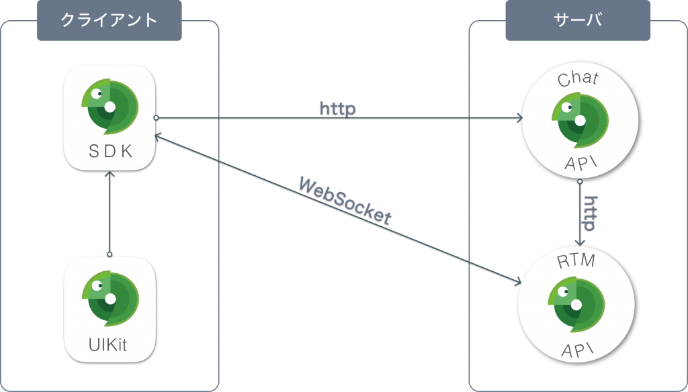

# スタートガイド

swagchatはサーバアプリケーションとなるChat API、RTM API (Real Time Messaging API)と、クライアントアプリケーション実装の為のキットとなるSDK、UIKitの4つで構成されています。

サーバ側の2つのAPIはアプリケーション自身がTCPポートをリッスンする為、別途ApacheやnginxのようなWebサーバを起動させる必要がありません。実行すれば即座に利用できます。TCPポート番号は自由に設定できます。
本格的に利用する場合はRDBやメッセージキュー、APIゲートウェイ、ログ収集を行う為のミドルウェアが必要になります。これらを利用する為のシステムアーキテクチャについては[こちら](architecture.md)を参照して下さい。
クライアントキットの2つについてはAPI通信を行う上でとても利便性の良いものです。必ず利用しなければいけないわけではありませんが、利用する事で実装が容易になりますので是非ご利用下さい。
以下にそれぞれの概要を説明します。とにかくまずは動かしてみたいという方は[クイックスタート]()をご参照下さい。

## Chat API

ユーザ管理やルーム管理、メッセージ送受信等のチャットアプリケーションを実現するのに必要な機能をREST APIとして提供しています。また、データの永続化にRDB（動作確認済DB：SQLite、MySQL、Google Cloud SQL）を利用します。
このAPIはセッションをもたないステートレスなAPIである為、水平スケールが可能です。キャパシティは利用するRDBに依存します。
Chat APIについては[こちら](chat-api/README.md)をご参照下さい。

## RTM API (Real Time Messaging API)

Chat APIだけでもチャット機能としては成り立ちますが、ユーザのエンゲージメントを高める為にはリアルタイム性が重要となります。RTM APIはWebSocket通信を利用してサーバからクライアントへPush配信を行う事でリアルタイム性を実現します。
メッセージングモデルはPub/Subモデルとなります。具体的にはクライアント側からパブリッシュして欲しいトピックとなるイベントをサブスクライブ要求し、Chat APIからのリクエストによりサブスクライバーにパブリッシュされます。
なお全てのデータはオンメモリの為永続化はされません。
このAPIはWebSocket通信を行うのでWebクライアント（一般的にはブラウザとなるでしょう）とTCPコネクションを張り続けます。つまりWebクライアントとAPIが稼働しているホストが直接1対1で接続される事になります。よってこのAPIをスケールする為にはバックエンドにPub/Subモデルのメッセージキューが必要となります。現状はこのメッセージキューに[NSQ](http://nsq.io/)を採用しています。
RTM APIについては[こちら](rtm-api/README.md)をご参照下さい。

## SDK

Chat API、RTM APIを利用する為のソフトウェア開発キットです。どちらのAPIもHTTPプロトコルによるWEB APIの為、SDKを利用しなくても利用できますがSDKを利用する事でコードがシンプルになり、エラーハンドリングも容易になります。
ただし現状はJavaScript ( TypeScript ) のみの提供である為、その他の言語は直接HTTP通信を行って頂く事になります。
SDKについては[こちら](sdk/README.md)をご参照下さい。

## UIKit

チャットで一般的に利用されるUIパーツをコンポーネントとして提供します。
UIKit内部ではSDKを利用してAPI通信を行いサーバからデータを取得している為、設置するたけでデータが表示されます。
もちろんUIに独自性を打ち出す必要があるのであればこのUIKitを利用せずに独自で実装して頂いた方が良いでしょう。
現状はReactコンポーネントとしてWeb UIとして提供している為、iOS、Android等のネイティブアプリプラットフォームは独自で実装して頂く必要があります。（ネイティブアプリのウェブビューを利用するのであれば利用可能です）

一般的にUIKitというとビジネスロジックが含まれていないピュアなUIコンポーネントを思い浮かべると思いますが、その場合開発者の実装の負担が大きすぎる為swagchatではビジネスロジックを組み込んだ状態でUIコンポーネントを提供しています。

UIKitについては[こちら](uikit/README.md)をご参照下さい。
