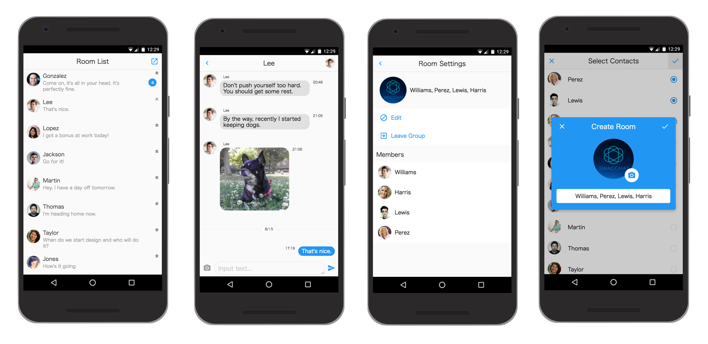
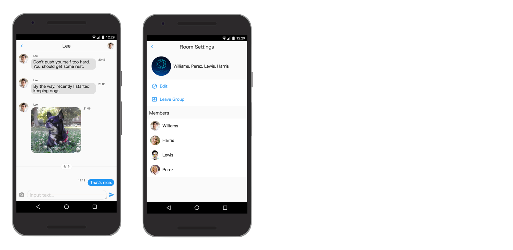

# UIKit

## タグを設置して動かす

swagchatで用意しているタグをHTMLページに設置する事により、ノンプログラミングで即座にチャットアプリケーションが動きます。

チャットアプリケーションには以下の2つが用意されています。

* [メッセンジャー](#メッセンジャー)
* [シンプルメッセンジャー](#シンプルメッセンジャー)

#### メッセンジャー

一般的なメッセンジャースタイルのチャットアプリケーションです。
複数のユーザとチャットを行ったりグループを作成して複数ユーザでチャットをする事が可能です。

 [タグ設置方法](chat-apps/messenger.md)

#### シンプルメッセンジャー

指定したルーム（1対1及びグループチャット）でのチャットができるメッセージ画面とルーム設定を行うだけのシンプルなチャットアプリケーションです。

 [タグ設置方法](chat-apps/simple-messenger.md)

### 動作確認ブラウザ

|  |  |  |  | | |
|:-:|:-:|:-:|:-:|:-:|:-:|
| Chrome | Firefox | Edge | Safari | iOS Safari | Chrome for Android |
| latest | latest | latest | 10+ | 10+ | 59+ |
